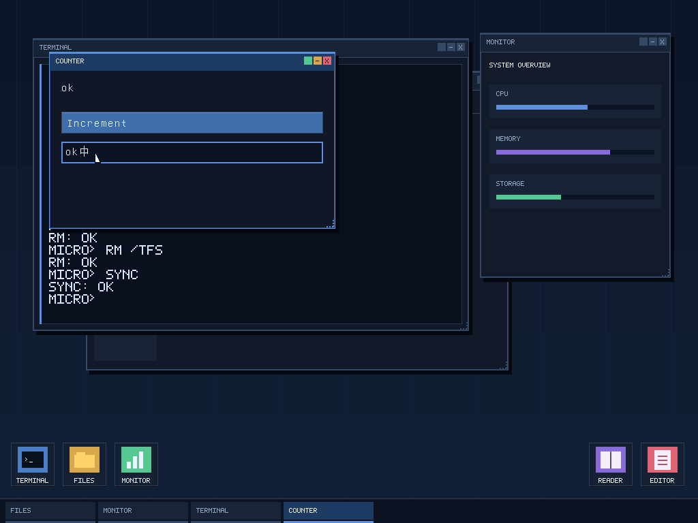
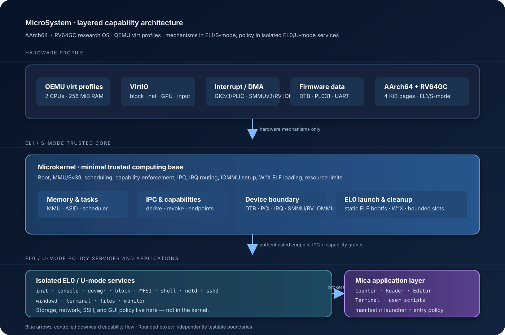

# MicroSystem


> 一次由 AI 辅助、从 AArch64 微内核延伸到存储、网络、SSH、GUI、用户态数据库与能力感知脚本运行时的完整操作系统生态实现尝试。

**简体中文** · [English](README.md)

MicroSystem 是一个小型、明确、端到端的操作系统实验。它并不是把 Linux 缩小重写，而是尝试回答一个更具体的问题：AI 能否帮助我们把一致的系统设计，从启动代码与硬件隔离一路推进到用户可操作的应用生态。

## 当前目标与实现状态

两个启动 profile 都已有真实 QEMU 串口证据。当前已验证的 RISC-V 链路是
RV64GC、QEMU `virt`、默认 OpenSBI 的 M-mode → S-mode 交接、Sv39、双 hart、
PLIC/SBI 定时器与中断服务、PCI VirtIO，以及 RISC-V IOMMU；串口完整到达
`[system] shutdown`。

RISC-V IOMMU gate 记录为
`blocked=true sentinel=true event=0xf stream-id=0x10 completion-error=false`。
同一运行还验证了 DMA map/unmap、RNG first-fill、MFS recovery 与 clean
`fsck`、串口 shell 完整文件系统命令矩阵、Mica 8 KiB 参数/输入路径，以及
network/DNS。AArch64 build 和串口运行也到达 shutdown。`make test` 日志内建
host suites 合计 `81/81`（`22+9+6+9+11+24`）；另行运行的 shell parser 为
`6/6`，因此合并记录的 host checks 是 `87/87`，不能写成 `make test` 自带
`87`。

精确的 `make ARCH=aarch64 test` 与 `make ARCH=riscv64 test` 完整矩阵仍是
`validation in progress`；执行中的状态不得写成 PASS。

最新源码还加入了常驻 EL0 `db` 服务和 `microsystem-sql` 库：通过串口 shell
的 `sql` 命令提供有界 CRUD SQL 子集，使用 capability 约束的 protocol 10
IPC 端点，并通过 MFS1 以 CRC32C 校验和原子替换持久化 MSQLDB1 snapshot。
这是 MicroSystem 自有存储格式，不是 SQLite 兼容实现。

GUI renderer 也已切换到浅蓝色系统界面：浅色 system bar、居中的 Dock 风格
启动区域、圆角窗口、左侧红/黄/绿控制点，以及蓝色 focus/selection accent。
GUI ABI 与 capability 边界保持不变；下面仓库内的 PNG 是此前的 VNC 画面，不
宣称是这次视觉刷新后的现场捕获。

## 运行画面

下面的画面来自仓库已有的 QEMU GUI profile；该 profile 会通过默认 `5900` 端口向 VNC 提供 guest 画面，是一张真实 GUI 帧：其中包含代码绘制的桌面、Terminal、Mica Counter、Monitor，以及 Files、Reader、Editor 启动器。



*这是此前 VNC-backed GUI 运行产生的 QMP screendump，不是 mockup，也不是 VNC 客户端外壳截图；本次仅整理文档，没有现场重新捕获。*

## 系统架构

设计将必须接触硬件的机制保留在 AArch64 EL1 或 RISC-V S-mode，并把设备
策略放到相互隔离的 EL0/U-mode 服务中。应用通过 broker IPC 与 capability
使用资源，不直接获得原始 framebuffer、块设备、网络、DMA 或 IRQ 权限。



主路径如下：

```text
QEMU virt-7.2 硬件
          ↓
EL1 微内核：MMU · 调度 · IPC · capability · IRQ/IOMMU
          ↓
EL0 服务：init · devmgr · block · MFS1 · db · netd · sshd · windowd
          ↓
Mica 脚本与 GUI 应用：Counter · Reader · Editor · Terminal
```

## 已实现的部分

| 层次 | 当前实验内容 |
| --- | --- |
| 内核 | AArch64 EL1 与 RV64GC S-mode 启动、MMU/Sv39、GICv3 或 PLIC/SBI 定时器/中断、调度、ASID、带 W^X 校验的 ELF 加载、capability 派生/撤销与有界资源回收 |
| 隔离 | 基于 DTB 的 PCI VirtIO 发现、SMMUv3 或 RISC-V IOMMU 域设置、设备授予，以及严格的特权机制 / 用户策略边界 |
| 存储 | MFS1 事务文件系统、元数据镜像、fsck、受限离线修复，以及断电和确定性故障注入路径 |
| 数据库 | 常驻 EL0 `db` 服务、有界 `microsystem-sql` CRUD 子集、4 KiB IPC 响应、全局 4,096 行预算、MSQLDB1 snapshot、CRC32C 校验、MFS1 原子持久化，以及损坏时 fail-closed |
| 网络与访问 | EL0 `netd`、端点 broker 网络、有限 HTTP/HTTPS 访问、SSH 会话，以及脚本权限交集策略 |
| 桌面 | VirtIO-GPU/输入设备 profile、代码绘制的 1024×768 桌面、保留式 GUI 命令流、窗口管理、输入批处理、damage culling，以及 Terminal、Files、Monitor、Reader、Editor |
| 运行时 | Mica 词法器/编译器/VM、能力感知权限、文件系统/网络/GUI broker，以及有界应用槽位 |

当前仓库面向 QEMU `virt-7.2` AArch64 与 RV64GC QEMU `virt` profile。它是
研究型原型，不是 Linux/POSIX 发行版、通用桌面系统，也不承诺任意真实硬件
或 ELF 兼容性。

## 快速开始

推荐使用固定 Rust toolchain 与 OrbStack Docker context：

```sh
docker context show                         # 预期：orbstack
make build
make test
make fsck
```

上面的命令是 AArch64 路径。`ARCH=riscv64 make build` 和
`ARCH=riscv64 make run` 会选择当前已验证的 RISC-V target/QEMU 路径。下面
是实际的低层命令形状：

```sh
ARCH=riscv64 cargo build --release \
  --target riscv64gc-unknown-none-elf \
  -p microsystem-kernel --features baremetal
ARCH=riscv64 qemu-system-riscv64 \
  -machine virt,iommu-sys=on -bios default -cpu rv64 \
  -kernel target/riscv64gc-unknown-none-elf/release/microsystem-kernel \
  -nographic
```

该 RISC-V 命令使用 QEMU 的默认 OpenSBI 固件：OpenSBI 运行在 M-mode，并把
带 DTB 的 S-mode 入口交给内核；仓库不内置 OpenSBI 镜像。profile 证据与完整
矩阵状态见[系统架构](docs/architecture.md)和[运行手册](docs/runbook.md)。

运行串口 shell：

```sh
make run
```

shell 文件系统命令使用绝对路径，同时支持简写和显式 `fs` 命名空间：
`ls/list`、`cat/read`、`stat`、`touch/create`、`cp`、`write`、`mkdir`、
`rmdir`、`mv/rename`、`rm/remove/unlink`、`fsync` 和 `sync`。文件传输受
4 KiB 文件系统共享帧限制。

串口 shell 的完整命令面还包括 `help`、`pwd`、`cd`、`echo`、`clear`、
`history`、`ps`、`kill`、`wait`、`uptime`、`sleep`、`date`、`free`、
`sysinfo`，以及 `head`、`tail`、`wc`、`hexdump/xxd`、`grep`、`find`、
`tree`、`du`、`df`；网络命令为 `curl`、`nslookup`、`netstat`，程序命令为
`run`、`mica`，系统命令为 `exit`、`shutdown`、`poweroff`、`reboot`。
`fs <command>` 暴露相同的文件系统命名空间和别名；支持有界选项
`head/tail -n N`、`mkdir -p`、`cp -r`、`rm -r`。

串口 shell 还提供有界 SQL 服务：

```text
sql CREATE TABLE users (id INTEGER PRIMARY KEY, name TEXT NOT NULL)
sql INSERT INTO users VALUES (1, 'Alice')
sql SELECT * FROM users WHERE id = 1
```

支持的子集包括 `CREATE`、`DROP`、`INSERT`、`SELECT`、`UPDATE`、`DELETE`，以及
`INTEGER`、`TEXT`、`BOOL`、`NULL`、primary key 和 `NOT NULL` 语义。每条语句
上限为 4 KiB；数据库全局最多 4,096 行；写入语句以一个有界 MFS1 snapshot
事务提交到 `/.system/db/main.db`。snapshot 损坏或不可用时，服务仍保持
`Ping` 在线，但会禁用 SQL 执行，不会静默替换数据库。完整 wire contract 与存储边界见
[`docs/abi.md`](docs/abi.md) 和 [`docs/architecture.md`](docs/architecture.md)；
该服务不兼容 SQLite。

串口 shell 还提供一个有界的 curl 风格 HTTP 客户端，支持 HTTP/HTTPS
GET、`-i`/`--include`、`-s`/`--silent`，以及写入绝对 MFS 路径的原子
`-o`/`--output`：

```text
curl -i https://example.com/
curl -s -o /data/response https://example.com/
```

它只通过 `net.browse` broker 执行 GET：HTTP 是明文路径，HTTPS 使用带证书、
主机名和时间校验的受信任 TLS 路径。响应上限为 32 KiB；串口输出要求正文
是 UTF-8，`-o` 会把响应原子写入绝对 MFS 路径并 fsync。原始 TCP/UDP、
POST/PUT/PATCH/DELETE 以及低层 TLS broker 不属于该命令边界。

GUI Terminal 与串口 shell 共享文件系统 parser、别名、绝对路径语义和 MFS
broker 行为。GUI Terminal 通过有界 terminal frame 暴露文件系统子集；进程、
网络、Mica 和电源命令仍属于串口 shell。

运行 GUI profile。QEMU 命令会打印 VNC/QMP 端点；默认 VNC 端口是 `5900`。

```sh
make gui
```

Mica 示例：

```text
mica -e 'print(40 + 2)'
mica --gui --timeout 86400s --allow gui.window /mica/gui-counter.mica
mica --gui --timeout 86400s --allow gui.window --allow net.browse \
  /.system/examples/mica/browser.mica -- https://example.com/
```

## 已记录的验收证据

仓库保留了详细 runbook 与原始 workflow 结果。当前证据包括上面的 RISC-V
QEMU 串口/IOMMU/设备 gate、AArch64 build 与串口 shutdown、`make test` 内建
host suites `81/81`，以及另行 shell parser `6/6`（合并记录 `87/87`）。精确的 `make ARCH=aarch64 test` 与
`make ARCH=riscv64 test` 完整矩阵仍为 `validation in progress`；本次文档
更新不重跑它们。证据来源与边界见 [`docs/runbook.md`](docs/runbook.md) 和
[`.workflow/microsystem-kernel/results/tests.md`](.workflow/microsystem-kernel/results/tests.md)。

## 仓库结构

```text
crates/kernel/     EL1 内核与 AArch64 启动/运行机制
crates/mfs1/       MFS1 文件系统实现
crates/sql/        有界 SQL parser、executor 与 MSQLDB1 snapshot 格式
crates/mica/       Mica 语言、VM、权限与标准库
crates/gui/        GUI ABI 与命令流类型
services/          静态 EL0 服务与示例应用，包括 `db`
assets/            guest 镜像使用的 CA 与字体输入
docs/              架构、ABI、GUI、MFS1、网络、SSH 与 runbook 文档
scripts/           OrbStack/QEMU 构建和验收辅助脚本
xtask/             镜像生成与 QEMU 编排
```

## 推荐阅读

- [系统架构](docs/architecture.md) — 启动、地址空间、IPC、capability、存储与 GUI 边界。
- [ABI](docs/abi.md) — protocol 10、数据库 frame、响应布局与服务契约。
- [GUI profile](docs/gui.md) — windowd、保留式 Present、输入、启动策略与 VNC/QEMU 路径。
- [Mica 编程说明（中文）](docs/mica-programming.zh-CN.md) — 从第一个脚本到权限、文件、HTTP 和 GUI 示例。
- [Mica Programming Guide](docs/mica-programming.md) — English guide for language basics and broker APIs.
- [Mica runtime contract](docs/mica.md) — 语言、VM 限制、权限与 broker API。
- [MFS1](docs/mfs1.md) — 事务格式、恢复、故障模型、fsck 与修复边界。
- [网络与 `netd`](docs/network.md) — 端点策略与有界网络能力。
- [SSH](docs/ssh.md) — SSH 命令与启动策略。
- [Runbook](docs/runbook.md) — 可复现命令与已有验收证据。

## 项目意图

MicroSystem 刻意保持足够小，便于阅读；同时保持足够完整，能够暴露真实取舍。核心问题很实际：AI 辅助的工程循环，能否交付的不只是零散内核代码，而是一套在存储、网络、GUI、应用、故障处理和安全边界上保持一致的操作系统生态？

答案仍在探索中。欢迎贡献代码、提出批评，并复现实验。

## 许可证

MicroSystem 采用 [MIT 开源许可证](LICENSE)。第三方素材仍遵循各自的许可
条款，详见 [`assets/`](assets/) 中的说明，包括随仓库提供的字体和证书材料。
